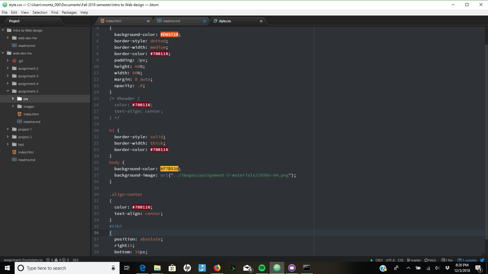

#Assignment 5
I decided to go with the 1950's for my project.  I tried to use the graphics in a way
that I thought reflects the nature of the 1950's style.
I found a color palette on coolors.com, and used several that I thought matched my graphics quite well.
The color hex codes I used were D8572A, 780116, and F7B538.
For this work cycle, I spent most of my time trying to figure out how to properly position everything on the page.
Getting what I needed aligned correctly was my biggests challenge, as well as successfully creating a background
that worked well.

