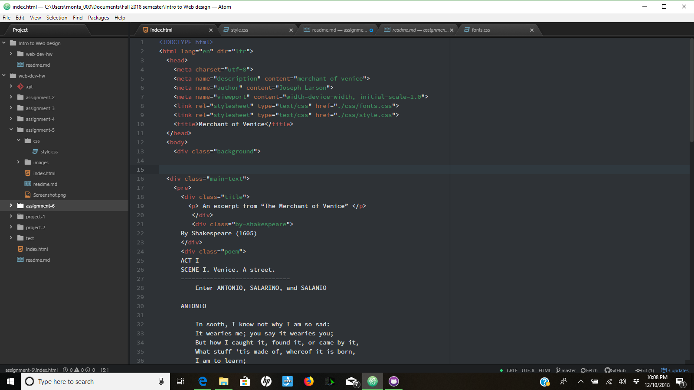

## assignment 6
For this assignment, I used the fonts serif and cursive.  It's important to have
fallback fonts in case a particular browser does not support certain types of font.
In this work cycle, I spent quite a bit of time with google fonts, trying to import them and
get them into my project, but was unable to get it figured out in the long run so I
decided to go with the fonts more easily accessable.

