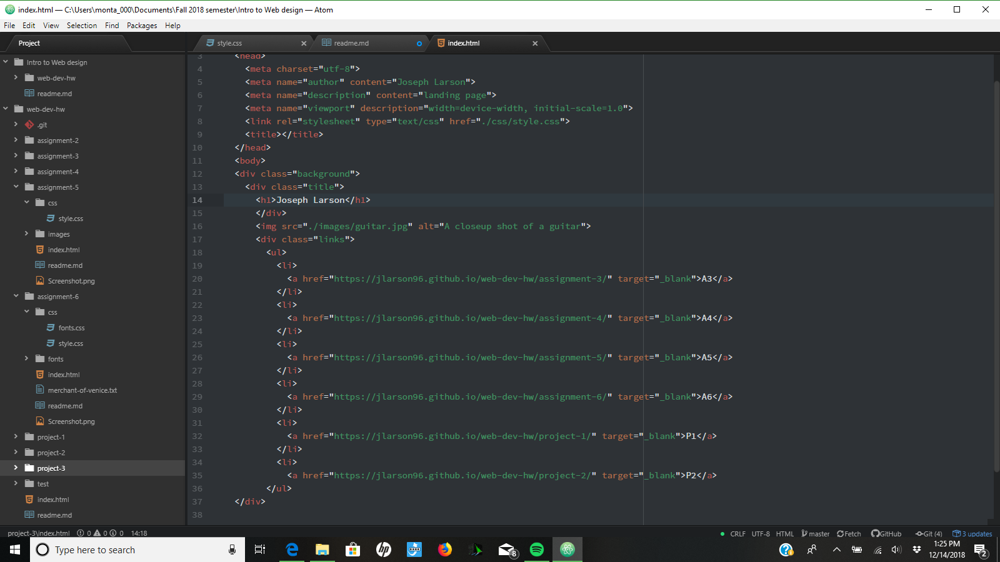

# Project 3
The border is something put around the content in your project.  The padding is the
space between your content and the border.  The margin is the space that is outside your border.
The hardest task for me in this project was getting the width of my title div correctly.
This work cycle seemed a little easier than some of the others, as some of the concepts
of coding are finally starting to click for me.  I hope to continue coding on my
own once this class is over to keep getting better at it.

